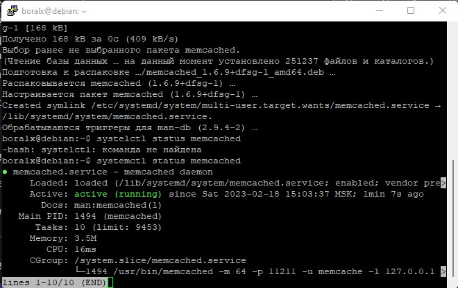
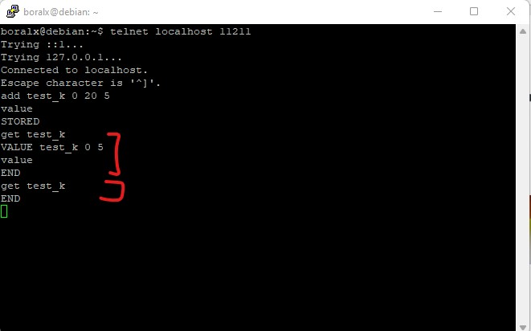
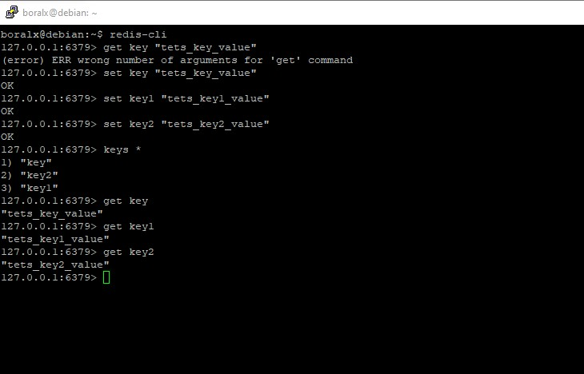
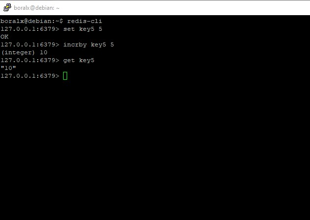

# Домашнее задание к занятию "`Кеширование Redis/memcached`" - `Борисов Александр`

### Задание 1 Кеширование

`Приведите примеры проблем, которые может решить кеширование.`

`Приведите ответ в свободной форме.`

Кэширование позволяет ускорить проиводительность ПО за счет использования оперативной памяти. Как пример хранение малоизменяющихся часто используемых данных из БД в оперативной памяти (кэше). Позволит не тратить время для чтения из БД. 

Так же в кэшированием частично можно решить проблему экономии ресурсов. Обработка данных в памяти не будет тратить ресурсы БД.

---

### Задание 2 Memcached

`Установите и запустите memcached.`

`Приведите скриншот systemctl status memcached, где будет видно, что memcached запущен.`

`

### Задание 3 Удаление по TTL в Memcached

`Запишите в memcached несколько ключей с любыми именами и значениями, для которых выставлен TTL 5`

`Приведите скриншот, на котором видно, что спустя 5 секунд ключи удалились из базы.`

`

### Задание 4 Запись данных в Redis

`Запишите в Redis несколько ключей с любыми именами и значениями.`

`Через redis-cli достаньте все записанные ключи и значения из базы, приведите скриншот этой операции.`

`

---
## Дополнительные задания (со звездочкой*)

Эти задания дополнительные (не обязательные к выполнению) и никак не повлияют на получение вами зачета по этому домашнему заданию. Вы можете их выполнить, если хотите глубже и/или шире разобраться в материале.

### Задание 5* Работа с числами

`Запишите в Redis ключ key5 со значением типа "int" равным числу 5. Увеличьте его на 5, чтобы в итоге в значении лежало число 10.`

`Приведите скриншот, где будут проделаны все операции и будет видно, что значение key5 стало равно 10.`

`
